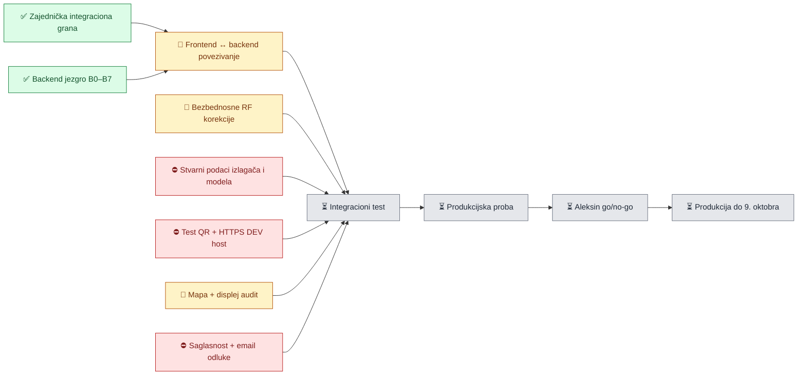

# Sajam automobila 2026 — komandni status

> **Status dokumenta:** živi operativni pregled  
> **Poslednje ažuriranje:** 7. oktobar 2026.
> **Vlasnik odluka:** Aleksa  
> **Aktivna integraciona grana:** `codex/sajam-integracija-2026-10-04`  
> **Završeni Garage checkpoint:** `8e72c10`
> **Najnoviji zajednički kodni sync checkpoint:** `c37bd0e`
> **Deljena grana za Aleksu i Jovana:** `origin/codex/sajam-integracija-2026-10-04`
> **Rok produkcijske spremnosti:** 9. oktobar 2026.

Ovaj dokument je komandni ekran za ljude: pokazuje **šta postoji, šta je provereno, šta nedostaje, šta je blokirano i ko je sledeći na potezu**.

Ne menja poslovni ili tehnički ugovor. Za proizvod važi [MASTER-KONTEKST](./MASTER-KONTEKST.md), za backend [BACKEND-HANDOFF](./BACKEND-HANDOFF.md) i [FAIR-BACKEND-CONTRACT](./FAIR-BACKEND-CONTRACT.md). Ako se dokumenti ili kod razilaze, status se označava kao problem i vraća komandnom centru — ne rešava se pretpostavkom.

## Legenda

| Oznaka | Značenje |
|---|---|
| ✅ | Završeno i provereno odgovarajućim dokazom |
| 👀 | Implementirano; čeka pregled čoveka ili potvrdu vlasnika |
| 🔧 | Postoji, ali zahteva korekciju ili povezivanje |
| 🟦 | Aktivno se radi |
| ⛔ | Blokirano nedostajućom odlukom, podatkom ili spoljnim uslovom |
| ⏳ | Nije započeto |
| ⚠️ | Poznat problem koji ne blokira trenutni korak, ali mora biti praćen |

## Pogled od 30 sekundi

| Oblast | Status | Šta to praktično znači |
|---|---:|---|
| Zajednička Git integracija | ✅ | Naš frontend, Garaža i Jovanov backend/mapa nalaze se na deljenoj Git grani koju obojica mogu da preuzmu |
| Automatska tehnička provera | ⚠️ | Check, Garage testovi i browser matrica prolaze; puna fair grupa ima 286/287 zbog nevezane dirty `seedShowcaseCatalog` authz registracije |
| Model stranica | 🔧 | Vizuelno radi, ali još koristi Audi fixture umesto stvarnog Convex modela |
| Backend jezgro | ✅ | Šema, paketi, QR, interakcije, analitika, izveštaji i retention postoje i imaju testove |
| Backend hardening | 🔧 | Četiri RF korekcije moraju biti završene pre integracionog testa |
| Mapa i displej | 👀 | Implementirani i testirani; čekaju pregled, stvarne podatke i osvežavanje uživo |
| Garaža | 🔧 | Mobilna ruta, selection režim, poređenje i sponsored tok su automatski provereni; native Samsung share još mora ručno da se potvrdi preko HTTPS origin-a |
| Pasoš | 👀 | Zaseban pregled i brend detalj rade nad stvarnim backendom; čeka ručna proba reveal/favorite toka sa osvojenim pečatima |
| Leadovi i email | ⛔ | Kod postoji, ali saglasnost, produkcijski prekidači i email podešavanja nisu zaključani |
| Stvarni izlagači i modeli | ⛔ | Čekaju se kompletni podaci i priprema stvarnog importa |
| QR štampa | ✅ | Kreirano je 100 trajnih dinamičkih modelskih kodova i 3 dinamička panel koda; završni materijal je poslat u štampu |
| Integracioni test | ⏳ | Ne počinje dok model stranica, hardening, HTTPS DEV i test podaci nisu spremni |
| Produkcija | ⏳ | Nema deploy-a; Aleksa je jedini go/no-go vlasnik |

## Mapa zavisnosti



## Kritični put — sledeći redosled

Ovo je redosled kojim se projekat trenutno odblokira. Stavka niže ne smatra se završenom samo zato što njen kod postoji.

1. **F3 — povezati model stranicu sa stvarnim backendom** `🔧`
   - [ ] `app/sajam/[eventSlug]/model/[modelSlug]` čita `fairPublic.getModelBySlug`.
   - [ ] Free/Starter/Advanced prava dolaze sa servera, ne iz query parametra.
   - [ ] Ocene, Glas publike, pasoš i lead forme koriste stvarne API rute.
   - [ ] Fixture ostaje samo kao DEV/test pomoć i nije javni izvor podataka.
   - [ ] Probna vožnja više ne traži datum.
   - [ ] `Zainteresovan sam` prihvata ime i najmanje jedan kontakt.

2. **RF korektivni backend korak** `🔧` — vlasnik: Jovan
   - [ ] Zajednička tajna gateway → Convex.
   - [ ] Ograničenje stvaranja novih anonimnih identiteta po IP hash-u.
   - [ ] Displej periodično ili reaktivno osvežava rotaciju i rezultat.
   - [ ] Poseban produkcijski prekidač za leadove.
   - [ ] Poseban produkcijski prekidač za follow-up.
   - [ ] Ručna izrada izveštaja pre kraja dana se odbija.

3. **Stvarni podaci i QR test tok** `⛔`
   - [ ] Prikupljeni izlagači, modeli, specifikacije, cene, paketi i pitanja.
   - [ ] Podaci normalizovani i prošli import dry-run.
   - [ ] Definisani highlight-i i grupe specifikacija.
   - [x] Pripremljeno 100 produkcijskih dinamičkih QR kodova i 3 panel koda.
   - [ ] HTTPS DEV host koristi odgovarajući Convex DEV.

4. **Pravni i email gate** `⛔`
   - [ ] Stručno odobren tekst saglasnosti sa ScanMe i konkretnim izlagačem.
   - [ ] Određen bezbedan primalac/kanal za PII svakog izlagača.
   - [ ] Potvrđeni email potvrde i follow-upa.
   - [ ] Podešen i proveren `FAIR_EMAIL_REPLY_TO`.
   - [ ] Poslat jedan ručni DEV test email.

5. **Ručni integracioni test** `⏳`
   - [ ] Oba događaja, najmanje 2 izlagača, 10 modela i sva 3 paketa.
   - [ ] Android telefon.
   - [ ] iPhone.
   - [ ] Displej 1920×1080.
   - [ ] QR → model → interakcija → admin → izveštaj.
   - [ ] Nema duplog brojanja skena niti lažne potvrde korisniku.

6. **Produkcijska proba i go/no-go** `⏳`
   - [ ] Stvarni env i tajne provereni bez njihovog zapisivanja u repo.
   - [ ] Stvarni QR inventar dodeljen modelima.
   - [ ] Mapa i sadržaj pregledani na stvarnim podacima.
   - [ ] Izveštaji i retention potvrđeni.
   - [ ] Aleksa daje finalni go/no-go i radi deploy.

---

## I — Integracija i zajednički repozitorijum

**Trenutni status: ✅ integrisano i objavljeno na deljenoj grani; ljudski pregled je u toku.**

- [x] ✅ I1 — Naš frontend sačuvan u checkpointu `70ef2a6`.
- [x] ✅ I2 — Jovanovih 13 B/M commitova preneto redom, bez squash-a.
- [x] ✅ I3 — Napravljena grana `codex/sajam-integracija-2026-10-04`.
- [x] ✅ I4 — Dodat Jovanov Claude kontekst uz master i backend dokumente.
- [x] ✅ I5 — `npm.cmd run check` prolazi.
- [x] ✅ I6 — Fair testovi: 280/280.
- [x] ✅ I7 — Mobilni checkpoint: 375×667, 390×844 i 412×915.
- [x] ✅ I8 — Golden harness: 177 slučajeva × 2 širine.
- [ ] 👀 I9 — Aleksa i Jovan pregledaju ukupno stanje.
- [x] ✅ I10 — Integraciona grana objavljena je kao `origin/codex/sajam-integracija-2026-10-04`.
- [ ] ⏳ I11 — Nije spojena u produkcijsku/ciljnu granu.
- [x] ✅ I12 — Produkcijski QR inventar i panel provisioner sinhronizovani su u zajedničku granu (`c37bd0e`).

**Poznata nesajamska stavka:** puni `npm test` ima 1537 prolaznih i jedan postojeći pad u `convex/memoriesHost.test.ts`. Nije nastao ovom integracijom.

## B — Backend, admin i QR

**Trenutni status: ✅ funkcionalno jezgro; 🔧 hardening obavezan.**

| ID | Stavka | Status | Dokaz / napomena |
|---|---|---:|---|
| B0 | Ugovor, entitlement-i i fair šema | ✅ | Testovi i `FAIR-BACKEND-CONTRACT.md` |
| B1 | Katalog, import, paketi i atomska QR dodela | ✅ | 70/70 na checkpointu; realni import nije izvršen |
| B1A | Admin tab `Događaji` | 👀 | Kod i testovi postoje; čeka pregled stvarnog UI-ja |
| B2 | Visitor identitet, `/r`, total/unique scan | 🔧 | Testovi prolaze; direktne Convex mutacije nisu dovoljno zaštićene |
| B3 | Ocene, Glas publike, anketa i pasoš | ✅ | Backend i šest POST tokova postoje |
| B4 | Leadovi, outbox, Resend seam, follow-up | ⛔ | Kod postoji; legalni i produkcijski gate nije spreman |
| B5 | Objavljeni Advanced sponsored snapshot | ✅ | Bez lažnog impression upisa |
| B6 | Analitika, PDF/XLSX/CSV i odobravanje | 🔧 | Preuranjen ručni report može blokirati automatski |
| B7 | Retention, authz, performanse i TEST seed | 👀 | Testirano; čeka odluku o automatskom purge-u |
| B8 | Deljeni linkovi i odvojena traffic analitika | 🔧 | Kolekcije, `share_action` i `share_open` postoje i ne dodiruju scan tabele; aktiviranje `direct_view` čeka F3 i QR entry marker |

## F — Javni mobilni frontend

**Trenutni status: 🔧 vizuelni slice radi, ali nije povezan sa stvarnim podacima.**

- [x] ✅ F1 — Topli showroom model stranica za Free/Starter/Advanced prikaze.
- [x] ✅ F2 — Mobilni raspored i touch interakcije provereni na tri širine.
- [x] ✅ F3 — Animacije specifikacija, formi, ocene i garaže postoje.
- [x] ✅ F4 — Glas publike ima izbor, rezultat i motion prototip.
- [ ] 🔧 F5 — Model ruta još koristi `lib/fair-client/model-fixtures.ts`.
- [ ] 🔧 F6 — Glas publike još koristi fixture/localStorage tok.
- [ ] 🔧 F7 — Ocene i lead forme nisu povezane sa Jovanovim API rutama.
- [ ] 🔧 F8 — Probna vožnja trenutno i dalje traži datum — suprotno zaključanom pravilu.
- [ ] 🔧 F9 — `Zainteresovan sam` treba proveriti prema pravilu „ime + bar jedan kontakt”.
- [ ] ⏳ F10 — Produkcijska error/retry stanja sa stvarnim backendom.
- [ ] ⏳ F11 — Konačan accessibility i reduced-motion prolaz na stvarnim tokovima.

## G — Garaža i pasoš

**Trenutni status: 👀 implementirano i automatski provereno; čeka Aleksin pregled stvarnog sadržaja.**

- [x] ✅ G1 — Lokalni browser storage bez naloga i obaveznog preuzimanja.
- [x] ✅ G2 — Dodavanje/uklanjanje modela i badge brojač na model stranici.
- [x] ✅ G3 — Javna ruta `/sajam/garaza` sa event-first shell-om i `noindex` pravilom.
- [x] ✅ G4 — Dva kompaktna event taba; događaji su hronološki poređani, a budući sajam je zaključan u produkciji do završetka prvog.
- [x] ✅ G5 — Dugi dodir ulazi u selection režim; običan dodir zatim bira do pet modela, dok poređenje zahteva tačno dva.
- [x] ✅ G6 — V2 lokalni dokument, V1 migracija i offline snapshot naziva, cene i fotografije.
- [x] ✅ G7 — Pasoši su izdvojeni na `/sajam/[eventSlug]/pasosi` i `/pasosi/[brandSlug]`; event shell ih otvara stalnom akcijom, a Garaža više ne duplira passport rail/modal.
- [ ] 👀 G8 — Čuvanje završenog digitalnog badge-a je implementirano i unit-testirano; čeka ručni test sa kompletiranim stvarnim pasošem.
- [x] ✅ G9 — Fixed Advanced rotacija najmanje na 12 sekundi, sa horizontalnim prelazom, border-trace detaljem, `Pogledaj` i `Dodaj u garažu`, pauzom tokom interakcije i safe-area insetom.
- [x] ✅ G10 — Dodavanje iz sponsored trake ima animirani prenos modela do badge-a; broj se menja tek po završetku prenosa.
- [x] ✅ G11 — Uklanjanje modela zahteva potvrdu i tek zatim izvodi izlaznu animaciju.
- [x] ✅ G12 — Greška osvežavanja je svedena na kompaktno stanje i ne potiskuje sadržaj Garaže.
- [x] ✅ G13 — Klijent šalje samo eksplicitne `open_model` i `garage_add`; nema impression upisa.
- [x] ✅ G14 — Long-press na fotografiji, tekstu ili praznoj površini bira model za poređenje bez otvaranja slike i bez selekcije teksta.
- [x] ✅ G15 — Sponsored dodavanje ume da obradi najmanje dva uzastopna modela; nova kartica ulazi FLIP animacijom bez remountovanja i ponovnog pojavljivanja postojeće liste.
- [x] ✅ G16 — Pregled pasoša koristi logo/naziv brenda, progres tačke i `Novo`; detalj koristi velike kartice modela, zaključani gradijent i map deep-link do štanda.
- [x] ✅ G17 — Sticky selection traka ostaje dostupna pri skrolu i nudi poređenje, deljenje, grupno uklanjanje i izlaz iz režima.
- [x] ✅ G18 — Svaka kartica ima zasebno deljenje; 2–5 modela dobijaju javnu `noindex` kolekciju na `/sajam/deli/[shareCode]`.
- [x] ✅ G19 — Podržan uređaj direktno poziva sistemski share sheet; aplikacijski WhatsApp/Viber/copy panel je fallback, a otkazivanje se ne broji kao uspeh.
- [x] ✅ G20 — Ugovor, šema i API strogo odvajaju QR scan, direktnu posetu, akciju deljenja i otvaranje deljenog linka; model-ruta će aktivirati `direct_view` tek u F3 uz QR entry marker.
- [ ] ⚠️ G21 — Na Aleksinom Samsung telefonu native share se nije otvorio tokom LAN HTTP probe. Ponoviti ručni test preko HTTPS origin-a; automatizovani `navigator.share` stub nije dovoljan dokaz kompatibilnosti.

## M — Mapa i sajamski displeji

**Trenutni status: 👀 implementirano i automatski provereno; nije finalno prihvaćeno.**

- [x] ✅ M0 — Geometrija četiri dobijene mape i `mapLocationId`.
- [x] ✅ M1 — Javna ruta `/sajam/[eventSlug]`, mobilni i desktop prikaz.
- [x] ✅ M2 — Advanced rotacija na 12 sekundi i isticanje štanda.
- [x] ✅ M3 — ScanMe zelena rezervisana samo za ScanMe lokaciju.
- [x] ✅ M4 — Nema glasanja direktno na mapi i nema impression upisa.
- [ ] 🔧 M5 — Displej mora da dobija nove rezultate/rotaciju bez reload-a.
- [ ] ⛔ M6 — Potvrditi tačnu poziciju ScanMe štanda.
- [ ] ⛔ M7 — Proveriti novije S1/S2 mape, deljene lokacije i dozvolu korišćenja logotipa.
- [ ] 👀 M8 — Aleksin vizuelni audit mape na 390, 1280 i 1920 px.
- [ ] ⛔ M9 — Potvrditi stvarnu rezoluciju i način rada sajamskih displeja.

## D — Podaci izlagača i fizički QR

**Trenutni status: ⛔ poslovni podaci blokiraju stvarni sadržaj.**

- [ ] ⛔ D1 — Lista stvarnih izlagača i postojeći ScanMe klijentski zapisi.
- [ ] ⛔ D2 — Modeli, varijante, cena, specifikacije i opcione fotografije.
- [ ] ⛔ D3 — Paketi i vreme aktivacije po modelu.
- [ ] ⛔ D4 — Pitanja Glasa publike, ankete i pasoš eligibility.
- [ ] ⛔ D5 — Kontakt zahtevi izlagača za leadove/probnu vožnju.
- [ ] ⛔ D6 — Report i PII primaoci po izlagaču.
- [ ] ⏳ D7 — Normalizacija CSV → import JSON.
- [ ] ⏳ D8 — Dry-run, pregled grešaka i odobren commit importa.
- [x] ✅ D9 — Kreirano 100 dinamičkih modelskih QR kodova sa oznakama `SA26-001`–`SA26-100`.
- [x] ✅ D10 — Završni paket od 100 kodova i paneli poslati su u štampu.
- [ ] ⏳ D11 — Dodeliti odštampane oznake stvarnim modelima i sačuvati audit dodele pre lepljenja.

**Vlasništvo:** Teodora prikuplja podatke; ScanMe tim ih sređuje i unosi; Aleksa odobrava stvarni import i štampu.

## E — Leadovi, email, izveštaji i privatnost

**Trenutni status: ⛔ kod postoji, produkcijska pravila nisu zatvorena.**

- [x] ✅ E1 — `Zainteresovan sam` i probna vožnja postoje kao odvojeni lead tipovi u backendu.
- [x] ✅ E2 — PII export je odvojen od agregatnog izveštaja.
- [x] ✅ E3 — Izveštaj se ne šalje bez ručnog odobrenja.
- [x] ✅ E4 — Idempotentni email retry sprečava duplikat.
- [x] ✅ E5 — Purge kod i preview/dry-run postoje.
- [ ] ⛔ E6 — Stručno odobren tekst saglasnosti i politike privatnosti.
- [ ] ⛔ E7 — Tvrdi prekidači za leadove i follow-up.
- [ ] ⛔ E8 — Finalni tekst potvrde i jednog follow-up emaila.
- [ ] ⛔ E9 — `FAIR_EMAIL_REPLY_TO`, pošiljalac i ručni DEV email test.
- [ ] 🔧 E10 — Blokirati ručni dnevni report pre zatvaranja dana.
- [ ] 🔧 E11 — Odlučiti kako agregati ostaju upotrebljivi posle PII purge-a.
- [ ] ⛔ E12 — Potvrditi primalac i vreme isporuke po izlagaču.
- [ ] ⛔ E13 — Odlučiti: automatski purge 16. novembra ili ručno odobrenje.
- [ ] ⏳ E14 — Ručna čeklista za brisanje lokalno preuzetih PII fajlova.

## Q — QA, integracioni test i produkcija

**Trenutni status: ⏳ automatsko jezgro zeleno; pravi tok još nije testiran od početka do kraja.**

- [x] ✅ Q1 — Lint bez grešaka; tri postojeća upozorenja.
- [x] ✅ Q2 — Next produkcijski build i TypeScript.
- [x] ✅ Q3 — Namespace i golden harness.
- [ ] ⚠️ Q4 — 286/287 sajamskih testova; jedini pad je nevezani dirty `seedShowcaseCatalog` koji još nije dodat u `fairAuthz.test.ts` klasifikaciju.
- [x] ✅ Q5 — Model mobile checkpoint na tri rezolucije.
- [x] ✅ Q5A — Garaža: 375×667, 390×844, 412×915, 844×390 i 1440×900; touch/long-press preko fotografije, centrirana compare kontrola, pasoš, glass potvrda uklanjanja, offline, dva uzastopna sponsored dodavanja bez remounta i reduced-motion.
- [x] ✅ Q5B — Selection/share tok: long-press, prvi sledeći dodir odmah menja izbor, vidljiv `X`, automatski izlaz kada nema izbora, Back zatvara lokalne slojeve, fixed toolbar pri skrolu, direktan native-share poziv uz aplikacijski fallback i zaseban `share_action` zahtev.
- [x] ✅ Q5C — Garaža pamti poslednji aktivni sajam bez pogrešnog početnog highlight-a; Auto Moto Fest je zaključan u produkciji do početka, ali ostaje dostupan u DEV-u radi testiranja modela.
- [ ] ⏳ Q6 — Stvarni QR → stvarni model → stvarna interakcija.
- [ ] ⏳ Q7 — Admin pregled leadova, interakcija i izveštaja sa stvarnim tokom.
- [ ] ⏳ Q8 — Android, iPhone i displej ručni test.
- [ ] ⏳ Q9 — Test mreže/NAT-a u hali ili bezbedna konzervativna postavka limita.
- [ ] ⏳ Q10 — Produkcijska env čeklista.
- [ ] ⏳ Q11 — Finalni sadržaj i vizuelni audit.
- [ ] ⏳ Q12 — Produkcijski deploy i smoke test.
- [ ] ⏳ Q13 — Aleksin finalni go/no-go.

## Odluke koje trenutno čekaju Aleksu

| ID | Odluka | Zašto je bitna | Preporučeni trenutak |
|---|---|---|---|
| O1 | Odobrenje B0 ugovora i odstupanja šeme | Jovan je nastavio pre formalnog pregleda | Tokom sadašnjeg pregleda |
| O2 | Automatski ili ručno odobren purge 16. novembra | Kod trenutno automatski briše u 00:00 | Pre produkcijskog deploy-a |
| O3 | Tačna pozicija ScanMe štanda | Bez nje se ScanMe lokacija ne prikazuje | Pre finalnog audita mape |
| O4 | Deljene lokacije štandova | Trenutna validacija traži jedinstvenu lokaciju | Pre stvarnog importa |
| O5 | Vreme zatvaranja dana za izveštaj | Određuje dnevni cron i poređenje | Pre integracionog testa izveštaja |
| O6 | Kanal predaje PII-a izlagačima | Bez toga leadovi ne smeju u produkciju | Pre aktivacije leadova |
| O7 | Finalni PDF/XLSX izgled izveštaja | Funkcionalni eksport postoji, izgled nije odobren | Pre prvog pravog izveštaja |

## Vlasništvo

| Vlasnik | Primarna odgovornost |
|---|---|
| **Aleksa** | Proizvod, javni UX, odluke, QR štampa, deploy i finalni go/no-go |
| **Jovan** | Convex, admin Događaji, QR/backend, mapa, izveštaji, email, retention i backend hardening |
| **Teodora** | Kontakt sa izlagačima i prikupljanje poslovnih podataka |
| **Komandni centar** | Zaključavanje odluka, frontend podela, integraciona kontrola i održavanje ovog statusa |

## Kako se ovaj status ažurira

Posle svake provere ili završenog zadatka:

1. promeniti oznaku samo ako postoji dokaz;
2. uz ✅ navesti test, commit, screenshot ili ručni scenario;
3. ako kod postoji, ali nije povezan ili pregledan, koristiti 🔧 ili 👀 — ne ✅;
4. novi problem dodati i u `docs/tasks/BLOCKED.md` ako zahteva odluku ili blokira drugi rad;
5. ažurirati datum, provereni HEAD i dnevnik ispod;
6. poslovna odluka se prvo upisuje u MASTER/contract, pa tek onda ovde menja status.

### Kratak format svakog status izveštaja

```text
Datum / HEAD:
Završeno i dokaz:
Promenjen status:
Novi problem ili blokator:
Sledeća konkretna akcija:
Vlasnik sledeće akcije:
```

## Dnevnik statusa

### 6. oktobar 2026. — QR štampa i novi zajednički checkpoint

- Produkcijski je kreirano 100 trajnih dinamičkih modelskih QR kodova i tri odvojena dinamička panel koda.
- Kodovi koriste postojeći `/r/[cardCode]` resolver; panel destinacije ostaju promenljive bez ponovne štampe.
- Završni PDF materijali poslati su u štampu i ručno je provereno više QR uzoraka.
- Implementacija produkcijskog QR inventara preneta je u integracionu granu kao checkpoint `c37bd0e`.
- Jovanov backend B0–B7 nije ponovo merge-ovan: iste izmene su već deo integracione istorije pod zajedničkim hash-evima.
- Sledeći programski kritični korak ostaje F3: povezivanje javne model stranice sa stvarnim backend projekcijama i write tokovima.

### 5. oktobar 2026. — javna Garaža

- Najnoviji Garage/share/history checkpoint je `8e72c10`.
- Ispravljeni su prvi tap posle long-press-a, prekinuta sponsored entrance animacija koja je ostavljala sivu karticu i pogrešan početni event highlight pri reload-u.
- Podržan browser sada direktno poziva platformski share sheet; aplikacijski WhatsApp/Viber/copy panel ostaje fallback.
- Automatizovani Garage browser scenario prolazi, ali ručni Samsung native-share test preko LAN HTTP-a nije uspeo i ostaje otvoren za HTTPS probu.
- Garage implementacija je sačuvana u checkpointu `7b6eddf` i objavljena na deljenoj integracionoj grani.
- Implementirane su `/sajam/garaza` i `/sajam/garaza/poredjenje`.
- Lokalni Garage dokument je migriran sa V1 na V2 bez promene storage ključa; dodat je lokalni passport badge katalog.
- Dodati su dva event taba, last-known offline kartice, izbor najviše dva modela, pasoši i Advanced rotacija.
- Sponsored tok beleži samo `open_model` i `garage_add` akcije.
- `scripts/fair/check-garage.mjs` prolazi na tri mobilne širine, landscape i desktop prikazu, uz touch, offline i reduced-motion scenario.
- Naknadni polish pokriva long-press preko fotografije/teksta, centriranu compare kontrolu, stabilan FLIP unos sponsored kartice, dva uzastopna dodavanja, sačuvanu review fotografiju, kraću refresh poruku, prazan `0/2` krug i zajednički čitljiv glass za passport/remove sheet.
- Ciljani Garage testovi prolaze 20/20; Next build prolazi.
- Cela fair grupa trenutno ima 286/287: nevezane postojeće izmene u `convex/fairDevFixtures*` dodaju `seedShowcaseCatalog`, ali dirty authz tabela još nije usaglašena. Garage fajlovi ne menjaju taj modul.
- Čeka se Aleksin vizuelni pregled i ručna proba završenog pasoša sa stvarnim podacima.

### 4. oktobar 2026. — integracija

- Naš frontend i Jovanov backend/mapa objedinjeni su na `codex/sajam-integracija-2026-10-04`.
- `npm.cmd run check` prolazi.
- Fair testovi prolaze 280/280.
- Mobilni model checkpoint prolazi na 375×667, 390×844 i 412×915.
- Potvrđeno je da model stranica i Glas publike još rade nad fixture podacima.
- Potvrđeno je da forma za probnu vožnju još traži datum i mora da se ispravi.
- Sledeći kritični korak je F3 povezivanje javnog model iskustva sa stvarnim backendom.
