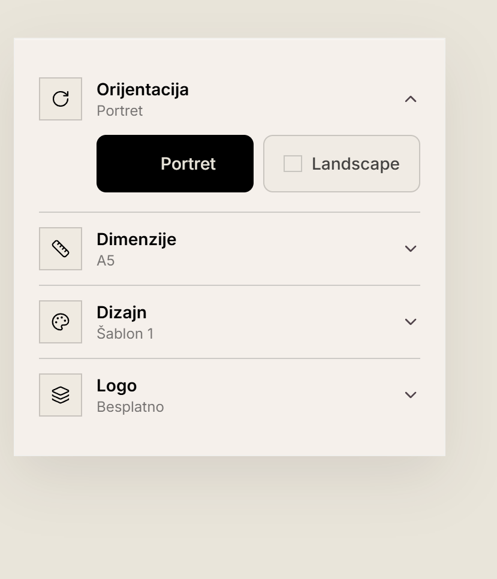
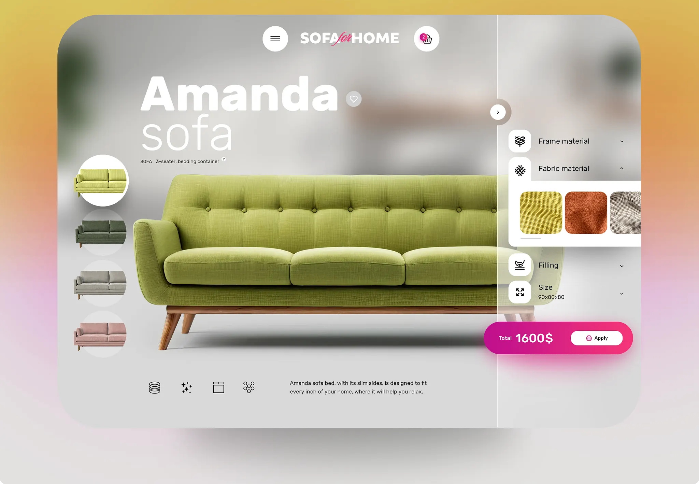
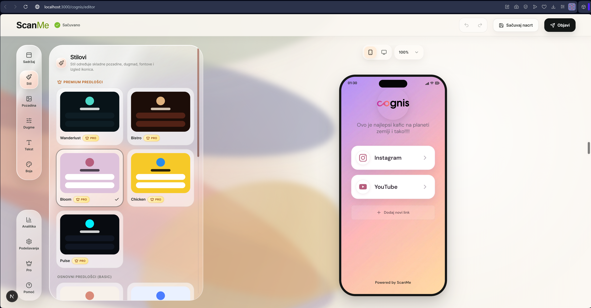
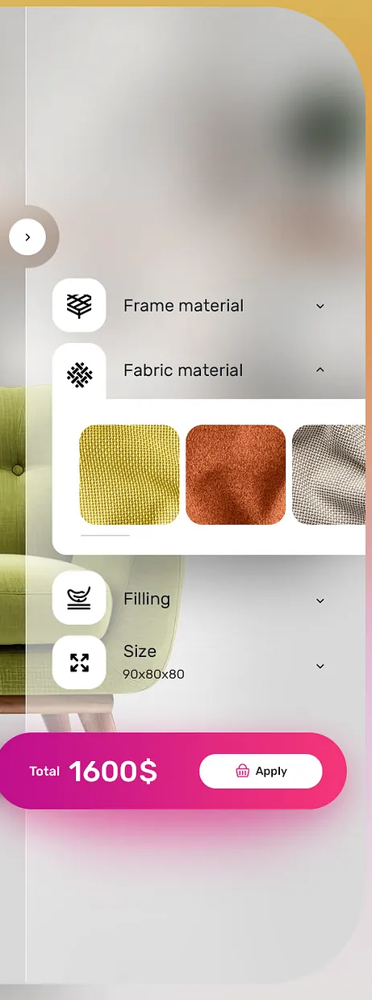
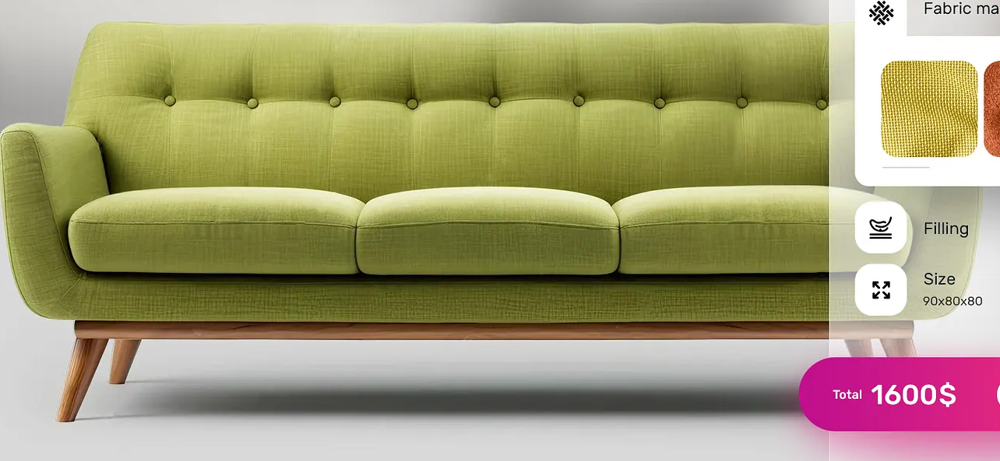
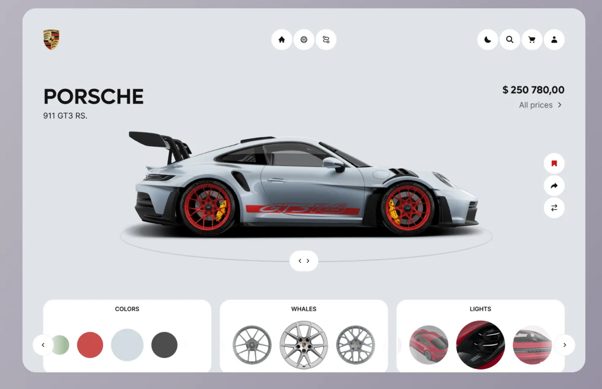
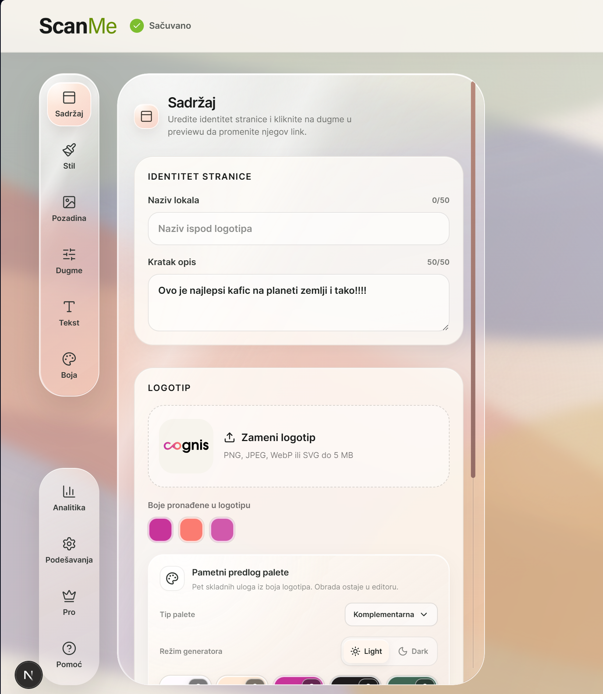

# ScanMe `/ponuda` — handoff za vizuelni redizajn product-studio konfiguratora

Ovaj dokument je izvor istine za narednu implementaciju. Postojeća funkcionalna verzija konfiguratora već postoji; zadatak nije da se pravi novi proizvodni tok, već da se njen vizuelni sloj i prostorna kompozicija temeljno preurede bez funkcionalnih regresija.

## Cilj

Stranica `/ponuda` treba da deluje kao savremen, čist i prijatan ScanMe product editor u kome klijent sastavlja ponudu pre kupovine. Glavni proizvod mora prirodno da živi u ambijentu, a ne unutar još jedne pravougaone preview kartice. Desna kontrolna zona mora da bude pravi, uz desnu ivicu scene vezan glass sidebar, po uzoru na reference u ovom folderu.

Ne kopirati brending, boje, sadržaj ili nameštaj iz sofa/Porsche referenci. Od njih se preuzimaju samo kompozicija, hijerarhija, integracija proizvoda u scenu, lakoća interfejsa i odnos centralnog previewa prema kontrolama.

## ZAKLJUČANO

### Odluke potvrđene sa korisnikom

1. **1A — redizajnira se ceo gornji konfigurator/studio**, ne samo desni panel. Leva selekcija, centralna scena, preview, obračun i desne kontrole treba da deluju kao jedan koherentan editor.
2. **2A — desni panel je pravi sidebar**, vezan za desnu ivicu velike scene i približno pune visine scene na desktopu. Ne sme izgledati kao odvojena bela kartica postavljena pored sadržaja.
3. **3A — koriste se kontekstualne ambijentalne scene**, prema vrsti proizvoda:
   - sto/pult za nalepnice, dvodelne i kompaktne stalke;
   - izlog/staklo za PVC foliju;
   - premium recepcija/hotel/restoran/salon za gravirane stalke.
4. ScanMe identitet ostaje: tople neutralne površine, čist crni tekst, Inter za UI, IBM Plex Mono samo tamo gde brojke/cene dobijaju korist od toga.
5. Lime `#C6FF4A` koristi se štedljivo: primarni CTA, jasno aktivno stanje ili važna informacija. Ne koristiti ga kao široku pozadinu ili dekoraciju.
6. Glass mora biti miran, topao i čitljiv, blizak ScanMe Links editoru. Bez agresivnog blur-a, glow-a, RGB prelamanja, „bubble“ estetike i debelih svetlećih ivica.
7. Live preview ostaje razumne veličine. Mali fizički predmet ne treba veštački uvećavati da bi popunio kadar kao sofa.
8. Postojeći sistem product PNG/cutout + DOM/template overlay može ostati funkcionalna osnova ove iteracije. Ne izmišljati potpuno novi 3D/compositing sistem u istom potezu.
9. Konfigurator ostaje `data-reveal="off"`; ne dodavati paralelnu word-reveal animaciju na dinamičku radnu površinu.

## Zašto je trenutna verzija odbijena

Slika `01-trenutni-rezultat-NE-kopirati.png` je negativna referenca.

- Desna zona izgleda kao obična pravougaona kartica, a ne kao sidebar.
- Glass efekat praktično nije prisutan i nema vizuelni kontekst kroz koji bi se video.
- Gotovo sve je zatvoreno u zasebne „kocke“, zbog čega editor deluje staro i fragmentisano.
- Preview je tretiran kao zalepljena slika u okviru, umesto kao fizički predmet prirodno postavljen u scenu.
- Prostorna hijerarhija ne prati sofa referencu: proizvod, kontrole i cena ne čine jednu kompoziciju.
- Utisak nije na nivou ScanMe Links editora koji korisnik vidi nakon kupovine, pa pre-purchase iskustvo šalje pogrešan signal o kvalitetu proizvoda.

Vizuelni redizajn nije završen ako se samo povećaju border-radius i blur na postojećim karticama. Potrebna je nova kompozicija cele radne površine.

## Reference koje se prilažu uz ovaj dokument

| Fajl | Uloga reference |
| --- | --- |
| `01-trenutni-rezultat-NE-kopirati.png` | Negativna referenca: pokazuje šta konkretno treba izbeći. |
| `02-glavna-layout-referenca-sofa.png` | Glavna kompoziciona referenca: proizvod u sceni, leva selekcija, desni sidebar i lebdeći price/CTA dock. |
| `03-scanme-links-editor-glass.png` | Izvor ScanMe vizuelnog jezika: topla scena, miran glass, organske površine i premium editor osećaj. |
| `04-sidebar-closeup-referenca.png` | Precizan odnos ikone, naslova, sekundarne vrednosti, strelice, separatora i otvorenog accordion sadržaja. |
| `05-integrisan-proizvod-i-price-dock.png` | Kako proizvod nije zarobljen u kartici i kako price/CTA element preklapa scenu/sidebar. |
| `06-organski-product-configurator.png` | Dodatna inspiracija za prostranu, mirnu product-studio kompoziciju sa jasnom hijerarhijom. |
| `07-scanme-links-glass-detail.png` | Dodatna referenca za topli ScanMe glass, pale tintove i čitljive površine. |

## Ciljna desktop kompozicija

Za širine od 1280 px naviše napraviti jednu veliku, koherentnu editor scenu ispod kompaktnog uvoda stranice.

### Jedinstvena stage površina

- Velika ambijentalna scena je osnovna površina konfiguratora. Može imati miran spoljašnji radius, okvirno 28–36 px, ali unutrašnji sadržaj ne sme biti niz nezavisnih kartica.
- Pozadina je fotografijski ambijent sa blagim dubinskim blur-om i dovoljno detalja da glass panel ima šta da refraktuje/zamagli.
- Preko scene koristiti vrlo suptilan tonalni overlay radi čitljivosti, bez generičnog gradijenta koji postaje glavni vizuelni element.
- Centralni proizvod postaviti u fizički smislen odnos sa stolom, pultom, staklom ili recepcijom. Senka/kontakt sa površinom mora sprečiti utisak „zalepljenog PNG-a“.
- Sam preview nema sopstvenu veliku pravougaonu pozadinu, border ni card shadow.

### Leva zona — izbor proizvoda i tiraž

- Leva zona je lagana vertikalna product rail/lista preko ili uz samu scenu, ne katalog kartica.
- Svaki proizvod treba da se prepozna prvenstveno preko male fotografije/siluete i kratkog naziva. Opis i preporučena primena mogu da se pojave za aktivan proizvod, bez pet velikih tekstualnih blokova istovremeno.
- Aktivno stanje treba da bude jasno, ali elegantno: promena tint-a, tanak outline, mali indikator ili kontrolisani lime detalj.
- Klik na proizvod zadržava postojeće ponašanje dodavanja i aktiviranja.
- Za izabrani proizvod prikazati `-5`, `-1`, editable količinu, `+1`, `+5` kao jednu kompaktnu, ergonomsku kontrolu. Ne praviti pet zasebnih kockastih dugmadi ako se mogu spojiti u jednu pill/stepper celinu.
- Uklanjanje ostaje zasebna jasna akcija i ne sme se vezati za spuštanje količine ispod 1.

### Sredina — aktivni proizvod

- Naziv aktivnog proizvoda, kratak opis i preporučena primena stoje diskretno u gornjem delu scene, sa dovoljno kontrasta ali bez hero-naslova veličine sofa reference.
- `Prikaz proizvoda` ostaje kompaktan switch/select za menjanje aktivnog previewa među svim izabranim proizvodima.
- SaaS picker ostaje mali chip u gornjem uglu: npr. `ScanMe Review · Starter · godišnje`; popover menja uslugu, paket i period.
- Proizvod zauzima samo onoliko prostora koliko njegova realna forma zahteva. Slobodan prostor je poželjan ako poboljšava lakoću i fokus.
- Promena proizvoda, orijentacije, dimenzije ili šablona zadržava približno 200 ms crossfade; `prefers-reduced-motion` menja sadržaj odmah.

### Desna zona — pravi glass sidebar

- Sidebar je vezan za desnu ivicu stage-a i vizuelno pripada istoj površini. Desktop širina okvirno 380–420 px, uz prilagođavanje stvarnom layoutu.
- Ide približno punom visinom scene. Njegova leva ivica može imati tanak highlight/refraction seam, ali ne debeo border.
- Ambijent iza njega ostaje vidljiv kroz topli glass tint. Panel ne sme delovati kao bela neprozirna kartica.
- Redovi: ikonica u malom lens/chip elementu, naslov, trenutna vrednost kao sekundarni tekst i caret. Koristiti suptilne separatore umesto zatvaranja svakog reda u novu karticu.
- Sekcije su `Orijentacija`, `Dimenzije`, `Dizajn`, `Logo`; na početku je otvorena `Orijentacija`, a accordion otvara jednu sekciju.
- Otvoreni sadržaj treba da izgleda kao integrisana translucent shelf/površina koja izlazi iz reda, ne kao nasumično ubačen beli card.
- Opcije moraju biti vizuelne, jasno poravnate, keyboard-accessible i imati vidljivo hover/focus/selected stanje.

### Obračun i primarna akcija

- Obračun i CTA više ne treba da budu još jedna velika kartica ispod previewa ako se mogu rešiti elegantnim floating price/CTA dock-om koji preklapa donji deo scene/sidebar-a, kao na referenci.
- Dock prikazuje poznati subtotal, uštedu/popust kada postoji i primarnu akciju bez skrivanja važnih podataka.
- Kada postoji custom dizajn, termin ostaje `Subtotal bez custom dizajna`, uz jasan status `Cena po dogovoru`; CTA vodi ka slanju upita/pregledu, ne prikazuje izmišljenu ukupnu cenu.
- Na desktopu dock može lebdeti pri dnu desne/srednje zone. Na mobilnom prelazi u sticky donju traku.

## Ambijentalne scene — 3A

Potrebne su tri međusobno usklađene scene, generisane kao zasebni raster asseti. Za ovo koristiti dostupni ImageGen skill i slediti njegove instrukcije.

### Scena A — sto/pult

Za nalepnice, dvodelne i kompaktne stalke. Moderan kafić/restoran ili uredan prodajni pult; u prvom planu jasna prazna površina za DOM/product cutout; pozadina blago van fokusa; topla dnevna ili ambijentalna svetlost.

### Scena B — izlog/staklo

Za PVC foliju. Čist izlog ili staklena površina sa naznakom ulice/lokala iza nje; dovoljno kontrasta da se providna folija vidi; kiša/kondenzacija mogu biti suptilan kontekst, ne vizuelni efekat preko cele scene.

### Scena C — premium recepcija

Za gravirani stalak. Hotel, restoran, salon ili reprezentativna recepcija; kvalitetni prirodni materijali; mirna i sofisticirana scena; jasna površina na kojoj proizvod fizički stoji.

### Zajednička pravila za generisanje

- Ista porodica kamere, visine pogleda, svetla, kontrasta i kolor-obrade.
- Bez teksta, QR koda, logotipa, brenda i bez već postavljenog ScanMe proizvoda.
- Bez ljudi u fokusu i bez elemenata koji se takmiče sa proizvodom.
- Ostaviti jasnu centralnu/levu safe zonu za proizvod i desnu zonu sa dovoljno detalja za glass.
- Izvor visoke rezolucije, poželjno 16:10 ili 3:2 za desktop; unapred proveriti kako se kropuje na 1024 i 390 px.
- Tamna tema treba prvenstveno da koristi kontrolisani tint/overlay i tokene, a ne potpuno drugačiji „matrix“ ambijent.

## Glass specifikacija

Pre implementacije obavezno pregledati stvarni ScanMe Links editor i postojeći liquid-glass izvor:

- `components/admin/scanme-links-editor.module.css`
  - postojeći selektori `.glassSurface` i `.contextPanel` su relevantna polazna tačka;
- `components/admin/scanme-links-editor.tsx`
  - pogledati kako se `contextPanel` koristi u realnom editor layoutu;
- `C:\My Stuff\Code\Components\liquid-glass-card.tsx`
  - koristiti kao tehničku/vizuelnu referencu za „pravi glass“, ne kopirati naslepo hardkodovan background source;
- postojeći slab offer glass je u `app/globals.css` pod `.offer-configurator-glass` i nije ciljna kvalitativna letvica.

Željeni materijal:

- umereni blur približno reda 10 px, prilagođen realnoj pozadini;
- blago povećana saturacija, oko 115–118%, bez fluorescentnog efekta;
- topao cream/peach/blush/mauve tint, približno 8–12% neprozirnosti;
- suptilna ivica/highlight i mala refrakcija, približno 1–1.5 px, samo ako je stabilna;
- miran i čitljiv centar panela;
- nenametljiva spoljašnja senka koja odvaja glass od ambijenta;
- bez `scaleY(-1)`, mirroring-a, negativnog texture scale-a ili duple Y korekcije;
- jedan deljeni lens/panel efekat ili kvalitetan CSS `backdrop-filter` fallback; ne praviti WebGL renderer za svaku malu kontrolu;
- obavezan fallback za reduced transparency/motion i browsere bez pune podrške.

Ako se koristi refraktivni canvas/WebGL, izvor pozadine mora biti konfigurabilan i poravnat u screen-space koordinatama sa stvarnom scenom. Orijentacija i sadržaj iza glass-a moraju ostati uspravni i prostorno poravnati.

## Funkcionalni ugovor koji ne sme da regresira

### Katalog i cene

- Nalepnice i stikeri: 290 RSD
- PVC folija za izloge i staklo: 390 RSD
- Dvodelni stalci: 1.200 RSD
- Kompaktni stalci: 550 RSD
- Premium gravirani stalci: 1.500 RSD

### State i pricing

- Default: Dvodelni stalak, količina 1, Portret, A5, Šablon 1.
- Svaki proizvod zasebno pamti količinu, orijentaciju, dimenziju i dizajn.
- Kontrole količine: `-5`, `-1`, direktan unos, `+1`, `+5`; minimum je 1.
- Popusti 0%, 8%, 17%, 25% i 30% računaju se nezavisno po proizvodu.
- Promena jednog proizvoda ne menja konfiguraciju drugih proizvoda.
- Moguće je dodati više proizvoda i prebacivati aktivni preview.
- Orijentacija, dimenzija i gotov šablon trenutno ne menjaju cenu.

### Dizajn i logo

- Pet postojećih šablona ostaje dostupno kao `Šablon 1–5`.
- `Custom dizajn` otvara opis do 500 karaktera po proizvodu i prikazuje neutralan placeholder.
- Gotovi šabloni: `Uključeno`; globalni logo: `Besplatno`; custom: `Cena po dogovoru`.
- Jedan globalni PNG ili SVG do 5 MB važi za celu ponudu.
- Preview logo stavlja okvirno u safe zonu i zadržava napomenu da ScanMe finalno prilagođava veličinu i položaj.

### Tokovi i backend

- Zadržati v2 URL round-trip, bezbedan v1 fallback, `/ponuda/pregled`, povratak na izmenu i strukturirani kontakt rezime.
- Zadržati postojeći Convex upload: session token, rate limit, MIME/size validaciju, commit, vezivanje za lead i čišćenje napuštenog uploada.
- Ne menjati backend ugovor zbog vizuelnog redizajna osim ako je dokazano neophodno.
- Svi novi vidljivi stringovi idu kroz typed `OfferDict` u `lib/i18n`.

## Relevantni postojeći fajlovi

- `components/offer-configurator.tsx` — glavni UI i postojeće stanje/interakcije;
- `app/ponuda/page.tsx` — konfigurator route;
- `app/ponuda/pregled/page.tsx` — pregled ponude;
- `app/globals.css` — trenutni offer stilovi i neadekvatan glass;
- `lib/scanme-pricing.ts` — proizvodi, cene i obračun;
- `lib/offer-url.ts` — URL codec;
- `lib/offer-contact.ts` — strukturirani rezime;
- `lib/i18n/types.ts` i `lib/i18n/sr/offer.ts` — typed tekst;
- `convex/offerLogoUploads.ts`, `convex/leads.ts`, `convex/schema.ts`, `convex/lib/rateLimits.ts` — upload/lead backend;
- `public/offer/templates` i `public/offer/products` — postojeći šabloni i product cutout asseti.

## Responsive ponašanje

### Desktop — 1280 px i više

- Jedinstvena velika scena, lagana leva product rail zona, centralni proizvod i desni edge-attached glass sidebar.
- Floating price/CTA dock pri dnu scene.
- Nema horizontalnog overflowa ni layout skokova pri otvaranju accordiona.

### Tablet — oko 1024 px

- Product izbor prelazi u horizontalnu traku iznad scene.
- Preview i uži glass panel ostaju dve jasne zone ako ima dovoljno prostora; sidebar ne sme postati zgnječena kartica.
- Ako dve kolone više nisu čitljive, controls panel prelazi ispod scene kao jedna glass površina, ne kao mreža kartica.

### Mobilni — oko 390 px

- Horizontalna product traka, zatim kompaktan ambijentalni preview.
- Kontrole dolaze kao accordioni ispod previewa ili kao jasno integrisan sheet; ne imitirati desktop sidebar po svaku cenu.
- Sticky donja traka sa subtotalom/statusom i CTA dugmetom.
- Potpuna keyboard/focus upotrebljivost, dovoljno veliki touch targeti i bez horizontalnog page overflowa.

## Predloženi redosled implementacije

1. Pročitati repo `AGENTS.md`, relevantne Next.js docs iz instalirane verzije i instrukcije dostupnih design/liquid-glass/imagegen/browser skillova.
2. Otvoriti trenutnu `/ponuda` i identifikovati state/event/pricing delove u `offer-configurator.tsx` koji moraju ostati netaknuti.
3. Pregledati ScanMe Links `.glassSurface`/`.contextPanel` i `liquid-glass-card.tsx`; definisati mali skup stvarnih glass tokena za ovaj editor.
4. Generisati tri usklađene scene bez proizvoda/teksta/QR-a i vizuelno proveriti njihove cropove.
5. Preurediti JSX u jednu stage kompoziciju. Ne počinjati kozmetičkim patchovanjem postojeće card mreže.
6. Integrisati postojeće product cutout/template/logo layere u scene sa smislenim scale/anchor/contact shadow vrednostima po proizvodu.
7. Izgraditi edge-attached sidebar, accordion hijerarhiju i floating price dock.
8. Završiti tablet/mobilni raspored, focus states, reduced motion/transparency i light/dark tokene.
9. Proći sve funkcionalne tokove i tek onda fino podešavati blur, tint, razmake i tipografiju kroz stvarne screenshot iteracije.

## Prihvatni kriterijumi

- Na 1440 px prvi utisak je jedinstven product studio, ne zbir kartica.
- Aktivni proizvod nije zatvoren u veliku pravougaonu preview karticu.
- Desni panel je očigledno sidebar vezan za scenu i koristi ambijent iza sebe da bi glass bio vidljiv.
- Accordion red ima pravilno poravnatu ikonu, naslov, vrednost i caret; otvoreni sadržaj prirodno izlazi iz reda.
- Nema „kocke u kocki“ obrasca za svaku opciju i svaku informaciju.
- Scene se menjaju smisleno između tri zaključana konteksta.
- Preview nije neprirodno uvećan; proizvod ima kontakt sa površinom i ne izgleda kao sirov zalepljen PNG.
- Lime je akcenat, ne dominantna paleta.
- Price/CTA dock deluje kao deo konfiguratora i jasno komunicira custom-price slučaj.
- Sva postojeća funkcionalnost, pricing, URL, pregled, kontakt i upload ostaju ispravni.
- UI radi na 1440, 1024 i 390 px, u svetloj i tamnoj temi, sa tastaturom i reduced-motion stanjem.
- Nema horizontalnog overflowa, console grešaka, pokvarenih focus stanja ili nečitljivog glass teksta.

## Obavezna validacija

1. Unit testovi za količine, popuste, izolaciju konfiguracije, pricing i URL round-trip.
2. Convex testovi za logo upload i lead vezivanje.
3. Browser QA na 1440, 1024 i 390 px; light/dark; više proizvoda; preview switch; svi accordioni; SaaS picker; upload; custom tok; pregled; povratak; keyboard; reduced motion.
4. `npm run test`.
5. `npm run check`.

Prethodno stanje pre ovog vizuelnog handoffa: testovi su prijavili 492 prolazna i 1 preskočen test; build je prolazio uz jedan postojeći lint warning u `components/admin/venue-admin.tsx` za neiskorišćen `useMemo`. Puni harness je bio blokiran već pokrenutim korisnikovim Next dev serverom na portu 3000 (PID je tada bio 7624). Ne gasiti korisnikov server napamet; prvo proveriti aktuelno stanje procesa i koordinisati port.

## PRIVREMENO

- Postojeći product cutout + DOM template overlay je dozvoljena privremena osnova. Precizniji photorealistic compositing/3D sistem je zasebna kasnija faza.
- Tri scene iz ovog pravca prvo prolaze vizuelnu proveru; nakon toga mogu dobiti novu generaciju ili precizniji crop bez menjanja zaključane UX strukture.
- Tačne širine sidebar-a, stage radius i anchor vrednosti proizvoda mogu se fino podesiti prema stvarnom browser rezultatu, dok se zadržava zaključana kompozicija.

## OTVORENO

- Finalni art direction i izbor konkretne generacije za svaku od tri scene.
- Fino pozicioniranje svakog od pet product cutoutova u odgovarajućem ambijentu.
- Da li će mobilne kontrole biti inline accordioni ili jedan kontrolisan bottom sheet, nakon poređenja stvarne upotrebljivosti na 390 px.
- Eventualni budući pravi mockup/compositing sistem koji menja privremeni DOM overlay — nije deo ovog vizuelnog popravnog prolaza.

## Poruka za pokretanje rada na drugom nalogu

Uz ovaj Markdown priložiti svih sedam PNG fajlova iz istog foldera i poslati:

> Implementiraj handoff iz `PONUDA-VISUAL-REDESIGN-HANDOFF.md` u postojećem ScanMe workspace-u. Slike iz paketa su vizuelne reference; `01-trenutni-rezultat-NE-kopirati.png` je negativna referenca. Ne pravi novi plan koji menja ZAKLJUČANE odluke. Prvo proveri trenutno stanje koda i da li je prethodna implementacija ostala nedovršena, zatim sprovedi redizajn do browser QA i validacije. Sačuvaj postojeću funkcionalnost i ne gasiti postojeći dev server bez provere.
